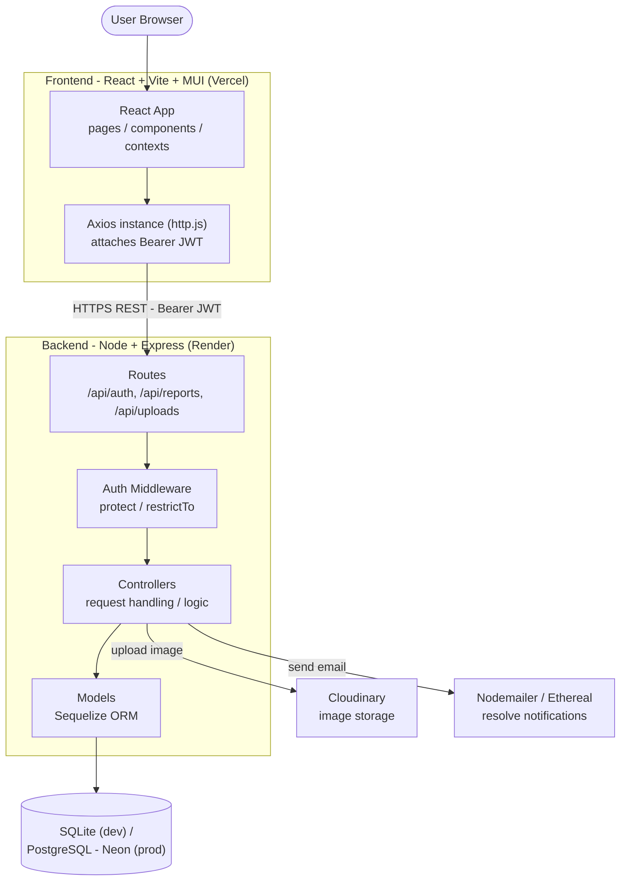

# System Architecture Diagram - 4E Flora, Fauna & Estate Biodiversity Tracker

Group system architecture diagram showing the main components and how they
connect. Reflects what is built today (Member 3 - auth, resident reports,
uploads) plus the planned cloud services. Teammate modules (M1 Flora, M2 Fauna,
M4 Alerts) are additional routes/controllers within the same backend - marked as
placeholders.

<!-- M1 Flora (Shernell): add flora feature routes/controllers/models in the backend; note any extra services -->
<!-- M2 Fauna (Renee): add fauna routes/controllers/models; add Map API (e.g. Leaflet) node + connection -->
<!-- M4 Alerts (Angelyn): add alerts routes/controllers/models; note GenAI service for weekly summary -->
<!-- Pending: confirm Generative AI provider (Gemini vs Claude) and add it as a service node once decided -->

## Notes

- The exported image (`architecture-diagram.png`) is generated from the Mermaid
  source above via [mermaid.live](https://mermaid.live). Re-export the PNG after
  adding teammate components so it stays in sync.
- Teammate modules (M1 Flora, M2 Fauna, M4 Alerts) are not separate services -
  they are additional feature routes -> controllers -> models inside the same
  Express backend, reusing the shared auth middleware and Sequelize/DB setup.
  Any new third-party services they introduce (e.g. a Map API for M2, a GenAI
  provider for M1/M4) should be added as nodes here.
- See `design/architecture.md` for the detailed folder-by-folder breakdown of
  the backend and frontend.
