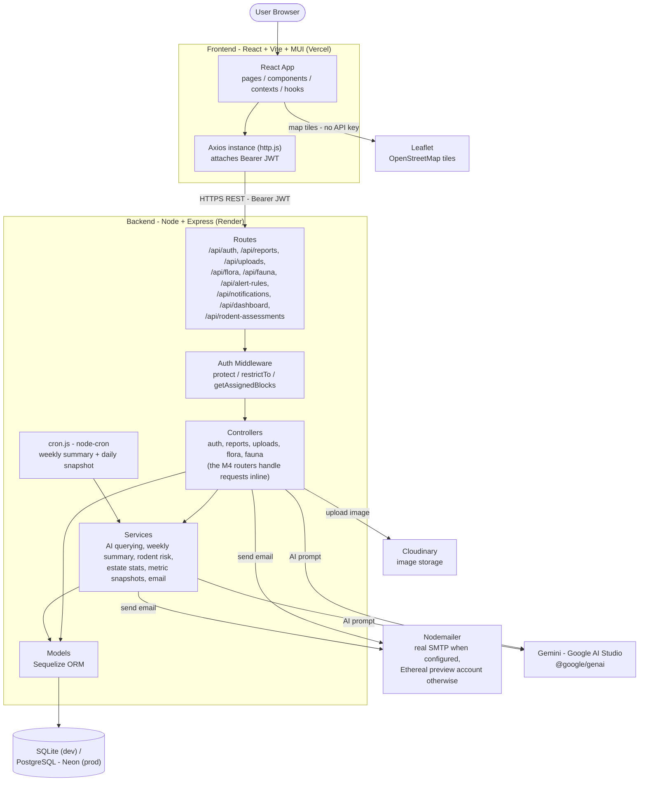

# System Architecture Diagram - 4E Flora, Fauna & Estate Biodiversity Tracker

Group system architecture diagram showing the main components and how they
connect. All four modules (M1 Flora, M2 Fauna, M3 Resident Reports &
Authentication, M4 Alerts) have shipped, and they are not separate services -
they are feature routes inside the same Express backend, sharing one auth
middleware, one Sequelize setup and one database.

## Notes

- The exported image (`architecture-diagram.png`) is generated from the Mermaid
  source above via [mermaid.live](https://mermaid.live). Re-export the PNG after
  changing the source so it stays in sync.
- The diagram is deliberately coarse: one node per layer, not one per file. The
  Controllers node also stands in for the M4 routers (alert rules, notifications,
  dashboard, rodent assessments), which keep their handlers inline in the router
  file instead of a separate controller.
- Gemini is reached from both layers: the AI services (`floraQueryService`,
  `geminiService`, `rodentService`) and directly from the flora and fauna
  controllers. Leaflet is the one third-party dependency the browser talks to
  itself - tiles are fetched by the frontend, not proxied through the backend.
- See `design/architecture.md` for the detailed folder-by-folder breakdown of
  the backend and frontend, and `deployment.md` at the repo root for how the
  hosted services are configured.
