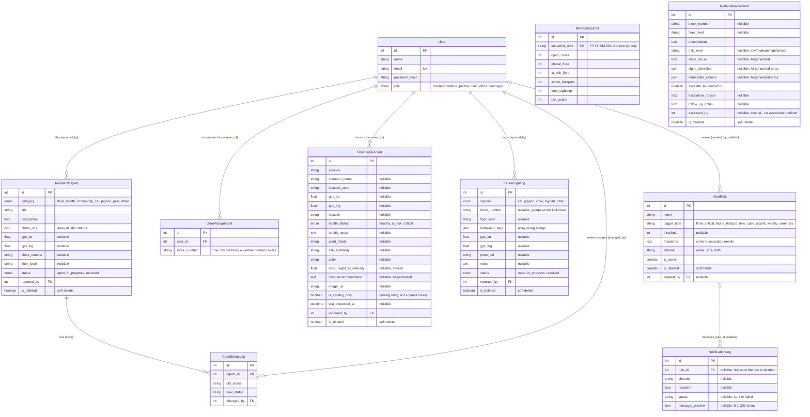

# Entity-Relationship Diagram - 4E Flora, Fauna & Estate Biodiversity Tracker

Group ER diagram covering the full system. All four modules have shipped, so
every entity below maps to a real Sequelize model in `backend/src/models/`.

## Notes

- The exported image (`er-diagram.png`) is generated from the Mermaid source
  above via [mermaid.live](https://mermaid.live). After changing the source,
  re-export the PNG so it stays in sync.
- Every entity maps directly to a Sequelize model in `backend/src/models/`, and
  the relationships above are the associations declared in
  `backend/src/models/index.js`. See `design/klemens/database-schema.md` for the
  full column-level schema of the M3 tables (`Users`, `ResidentReports`,
  `CaseStatusLogs`).
- `createdAt` and `updatedAt` are omitted from every entity block above. Every
  model uses the Sequelize default `timestamps: true`, so both columns exist on
  all tables.
- `MetricSnapshot` and `RodentAssessment` have no associations in
  `models/index.js`, so they are drawn unconnected. `RodentAssessment.assessed_by`
  holds a `User.id` but is a plain integer column with neither a `references`
  clause nor an association, so it is not marked FK.
- `AlertRule.created_by` and `NotificationLog.rule_id` are nullable, which is why
  those two relationships use the optional (zero-or-one) parent cardinality.
- Soft delete is a boolean flag, not a row deletion: `ResidentReport`,
  `GreeneryRecord`, `FaunaSighting`, `AlertRule` and `RodentAssessment` all carry
  `is_deleted`, and records with it set are hidden from lists but retained.
