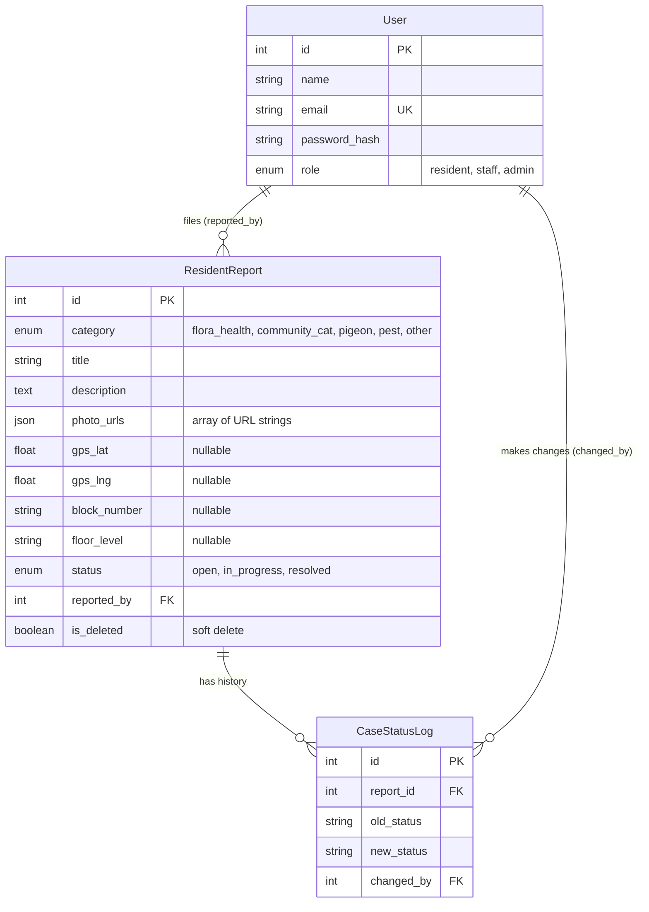

# Entity-Relationship Diagram - 4E Flora, Fauna & Estate Biodiversity Tracker

Group ER diagram covering the full system. The Member 3 entities (authentication
and resident reports) are complete below; teammate entities (M1 Flora, M2 Fauna,
M4 Alerts) are placeholders to be added later.

<!-- M1 Flora (Shernell): add GreeneryRecord (or your flora entities) + relationships to User -->
<!-- M2 Fauna (Renee): add FaunaSighting (or your fauna entities) + relationships -->
<!-- M4 Alerts (Angelyn): add Alert/Notification entities + relationships -->

## Notes

- The exported image (`er-diagram.png`) is generated from the Mermaid source
  above via [mermaid.live](https://mermaid.live). After adding new entities,
  re-export the PNG so it stays in sync with this source.
- Member 3 entities map directly to the Sequelize models in
  `backend/src/models/` - see `design/klemens/database-schema.md` for the full
  column-level schema.
